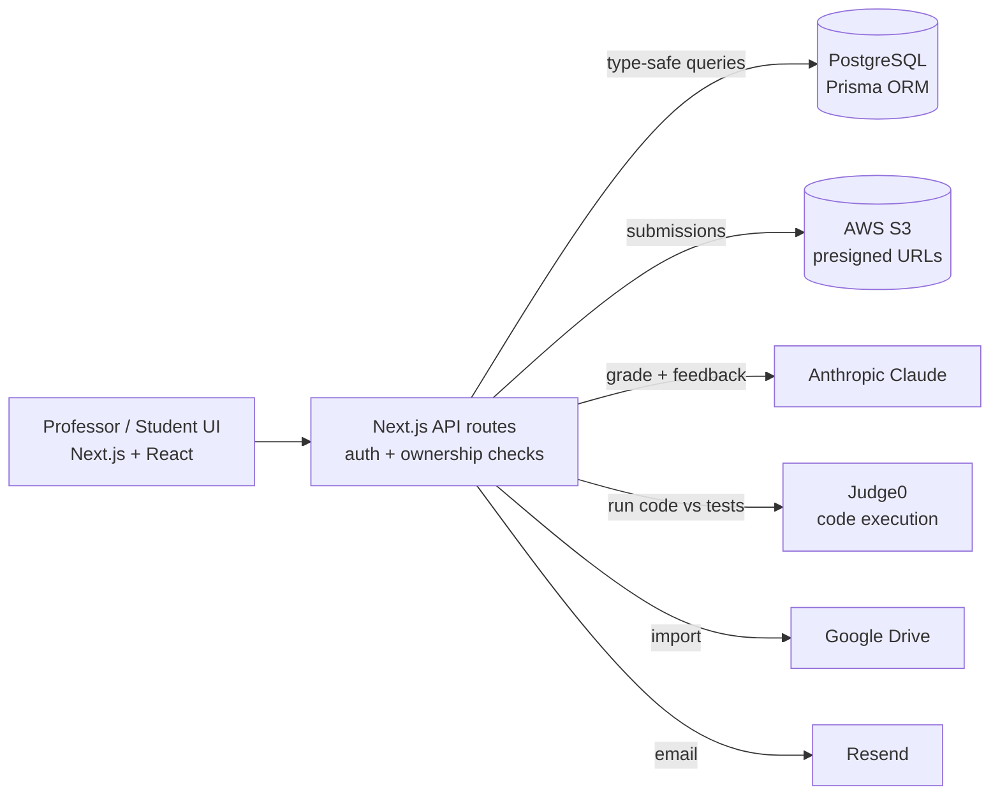

# GWiz

**An AI grading assistant for professors — upload student submissions, grade them against a rubric with AI, automatically run and test student code, and produce editable feedback and exportable reports.**

Production-grade full-stack app built solo, with a real security audit behind it.

<!-- TODO: hero screenshot or demo GIF (grading a submission → feedback) -->
<!-- 🔗 Live demo: <URL> -->

> **Source availability:** private production codebase. This repository is a curated showcase — architecture, engineering highlights, and screenshots. Happy to walk through the code live or grant read access on request.

---

## The problem

Grading is slow, inconsistent, and hard to scale — especially for code assignments, where truly assessing work means *running* it. GWiz gives professors an AI grader that scores against their own rubric, executes student code against test cases, and drafts feedback they can review and edit before it goes back to students.

## What it does

- **Rubric-based AI grading** — grade submissions against a professor-defined rubric, with configurable feedback **tone dimensions**.
- **Automated code execution** — student code is run against professor-defined test cases (via a Judge0 execution backend) as part of grading, not just read.
- **Review-and-edit workflow** — a side-by-side review UI (submission + grades) where the professor adjusts AI-proposed grades and feedback before finalizing.
- **Roles & assignments** — professor and student roles; assignment creation, submission handling, and per-assignment settings.
- **Flexible I/O** — upload submissions (content-type allowlisted, size-capped) or import from Google Drive; export graded reports to **DOCX, PDF, CSV, and ZIP**.
- **Multi-language UI** — internationalized with `next-intl`.

## Architecture

**Frontend** — Next.js (App Router), React, Tailwind + Radix UI, `react-markdown` + `highlight.js` for rendered feedback, resizable review panels, dark mode, `next-intl` i18n.

**Backend** — Next.js API routes with auth + ownership verification on every route; PostgreSQL via Prisma; NextAuth; AWS S3 with presigned URLs; Judge0 for sandboxed code execution; Google Drive import; Resend email; Sentry monitoring.

**Security** — audited against the OWASP top 10: authenticated + ownership-checked routes, file-upload content-type allowlist with a 50MB cap, hashed passwords, CSRF protection, security headers (HSTS, X-Frame-Options, Referrer-Policy), and per-user rate limiting on every AI endpoint. Handles student academic data with FERPA considerations in mind.

## Notable engineering decisions

- **Grading that runs the code** — integrating Judge0 means code assignments are assessed by execution against test cases, not just static review.
- **Human-in-the-loop by design** — AI proposes; the professor reviews and edits before anything is finalized.
- **Security-first** — a documented pre-launch security pass covering auth, authorization, input validation, rate limiting, and headers.

## Tech stack

`Next.js` · `React` · `TypeScript` · `Tailwind CSS` · `Radix UI` · `PostgreSQL` · `Prisma` · `NextAuth` · `AWS S3` · `Judge0` · `Anthropic Claude` · `Google Drive API` · `Resend` · `Sentry` · `Zod`

## My role

Sole designer and developer — data model, API, grading pipeline, code-execution integration, review UI, and security hardening.
